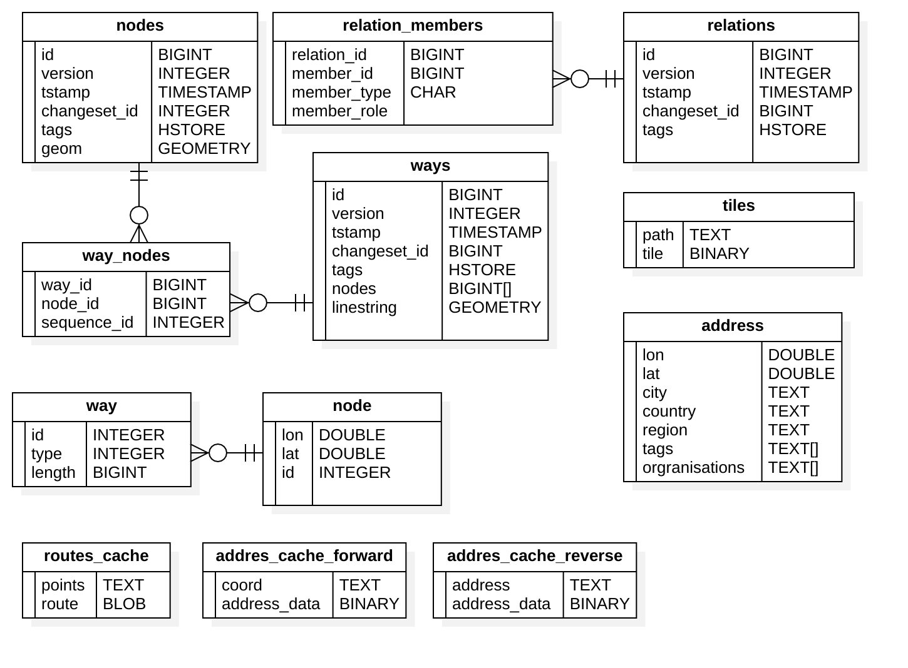
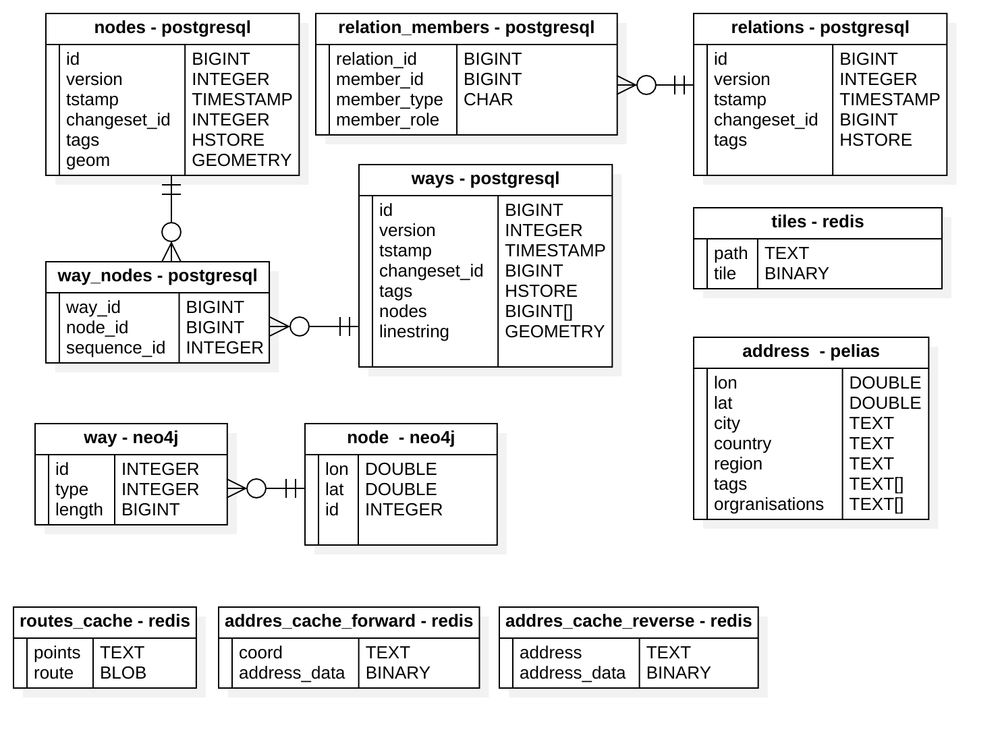
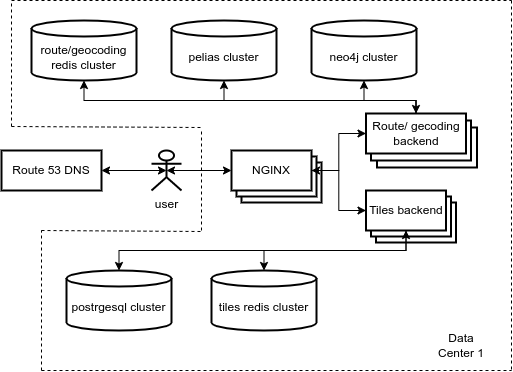

## 1. Тема и целевая аудитория

В работе рассматривается *картографический сервис*. Пример так таких сервисов и размер их аудитории:

| Сервис      | MAU             |
| ----------- | --------------- |
| Google Maps | ~1.5 млрд. [^1] |
| Apple Maps  | 590 млн.[^1]    |
| Maps Me     | 60 млн.[^2]     |
| Waze        | 140 млн.[^3]    |
| MapQuest    | 40 млн.[^4]     |

### MAU

Исходя из представленных данных, потенциальная максимальная месячная аудитория сервиса может составлять **150-200 млн.** пользователей (Google Maps и Apple Maps вероятнее всего достигли выдающих размеров аудитории в том числе за счет переустановки приложений в Android и IOS[^1]).

### DAU

Известна статистика об использовании картографических приложений: 11.3% пользователей используют приложения каждый день, 39% множество раз в неделю (допустим 5 раз в неделю), 27% несколько раз в неделю (допустим 3 раза в неделю), 19.5% используют несколько раз в месяц (допустим 3 раза в месяц) [^5]. Исходя их этого, можно рассчитать что DAU составляет `11.3 + 39 * 5/7+27 * 3/7 + 19.5 * 3/30 = 52.7%` от MAU. Таким образом, для проектируемого сервиса, число ежедневных пользователей - **80-105 млн.**

### Расположение аудитории

Сервисы-аналоги обслуживают аудиторию со всего мира. Исходя из данных по распределению пользователей Интернета по частям света[^6] , можно рассчитывать на следующие размеры аудитории (тут и далее положим MAU и DAU сервиса **175 млн.** и **93 млн.** соответственно):

| Регион              | MAU, млн | DAU, млн |
| ------------------- | -------- | -------- |
| Северная Америка    | 11.8     | 6.2      |
| Южная Америка       | 16.8     | 8.9      |
| Европа              | 31.9     | 16.9     |
| Азия                | 93.5     | 49.7     |
| Африка              | 20.1     | 10.7     |
| Австралия и Океания | 1.05     | 0.6      |

### MVP

Ключевой функционал сервиса:

1. Просмотр тайловой карты
2. Геокодинг (поиск координат по адресу)
3. Построение маршрутов

## 2. Расчет нагрузки
### Действия пользователя

Согласно исследованию поведения пользователей в картографических приложениях, среднее время пользовательской сессии составляет 65 секунд[^5], пользователь использует приложение несколько раз в день (1-3 раза). Из этого же исследования известно распределение времени сессии на взаимодействие с функционалом сервиса:

* Map-View Manipulations занимают 67.5% времени сессии. В это взаимодействие входит просмотр, зум и скролинг карты.
  Т.о. манипуляции с просмотром карты занимают в среднем 44 секунды. Предположим что пользователь за это время может обновить экран c карт 6-8 раз (с учетом смены зума). 

  При смене положения карты/уровня зума, происходит запрос тайлов карты. Размер тайлов, обычно 256х256 пикселей и для покрытия экрана 1920х1080 пикселей требуется 40 тайлов. Таким образом за время сессии будет запрашиваться примерно **280 тайлов**. 

* Direction (построение маршрутов) занимают 21.1% времени сессии, т.е. 14 секунд, предположим что за это время пользователь делает **1-2 запроса** на построение маршрута. 

* Place и Search запросы (геокодинг) занимаю 11.4% времени или 8 секунд. За это время пользователь может успеть сделать **3-4 запроса**.

### RPS

Рассчитаем нагрузку на сервис с учетом, что пользователи используют сервис 2 раза в день, а запросы запросы распределены равномерно в течении 24 часов, т.к. аудитория расположена во всех часовых поясах. :

1. Просмотр тайловой карты: `93000000 * 280 * 2  / (24 * 60 * 60) = 602777 RPS`
2. Геокодинг: `93000000 * 4 * 2  / (24 * 60 * 60) = 8611 RPS`
3. Построение маршрутов: `93000000 * 2 * 2  / (24 * 60 * 60) = 4305 RPS`

Сводная таблица по запросам:

| Тип запроса             | RPS     |
| ----------------------- | ------- |
| Просмотр тайловой карты | 602'777 |
| Геокодинг               | 8'611   |
| Построение маршрутов    | 4'305   |
| **Итого**               | 615'693 |

### Трафик

Рассмотрим нагрузку сетевого трафика. В расчетах будем полагаться, что:

* Тайлы представлены в векторном формате[^7] и занимают в серднем **30 КБ**.
* Построенные маршруты представляют собой набор точек на тайлах и занимают **5КБ**.
* Ответы на гекодинг запросы представляют собой точу на тайле/адрес и занимают **1КБ**

Пиковое потребление предполагает увеличение нагрузки в 2 раза.

#### Трафик входящий

1. Загрузка тайла: 

   * Пиковое потребление: `1 КБ * 2 * 602777 RPS = 1205554 КБ/c = 9.6 ГБит/с`

   * Суточное потребление: `1 КБ * 93000000 * 280 * 2 = 52 ТБ `

2. Геокодинг:

   * Пиковое потребление: `1 КБ * 2 * 8611 RPS = 17222 КБ/c = 0.14 ГБит/с`

   * Суточное потребление: `1 КБ * 93000000 * 4 * 2 = 0.74 ТБ `

3. Построение маршрутов: 

   * Пиковое потребление: `1 КБ * 2 * 4305 RPS = 8610 КБ/c = 0.07 ГБит/с`

   * Суточное потребление: `1 КБ * 93000000 * 2 * 2 = 0.37 ТБ `

| Запрос               | Объем 1 запроса | Пиковое потребление (ГБит/с) | Суточное потребление (ТБ/Сутки) |
| -------------------- | --------------- | ---------------------------- | ------------------------------- |
| Загрузка тайла       | 1 КБ            | 9.6                          | 52                              |
| Гекодинг             | 1 КБ            | 0.14                         | 0.74                            |
| Построение маршрутов | 1 КБ            | 0.07                         | 0.37                            |

#### Трафик исходящий

1. Загрузка тайла: 

   * Пиковое потребление: `30 КБ * 2 * 602777 RPS = 36166620 КБ/c = 289 ГБит/с`

   * Суточное потребление: `30 КБ * 93000000 * 280 * 2 = 1000 ТБ `

2. Геокодинг:

   * Пиковое потребление: `1 КБ * 2 * 8611 RPS = 17222 КБ/c = 0.14 ГБит/с`

   * Суточное потребление: `1 КБ * 93000000 * 4 * 2 = 0.74 ТБ `

3. Построение маршрутов: 

   * Пиковое потребление: `5 КБ * 2 * 4305 RPS = 43050 КБ/c = 0.34 ГБит/с`

   * Суточное потребление: `5 КБ * 93000000 * 2 * 2 = 1.86 ТБ `

| Запрос               | Объем 1 ответа | Пиковое потребление (ГБит/с) | Суточное потребление (ТБ/Сутки) |
| -------------------- | -------------- | ---------------------------- | ------------------------------- |
| Загрузка тайла       | 30 КБ          | 289                          | 1000                            |
| Гекодинг             | 1 КБ           | 0.14                         | 0.74                            |
| Построение маршрутов | 5 КБ           | 1.86                         | 1.86                            |

## 3. Логическая схема

База данных имеет постоянный размер. Для базы данных, вмещающей всю Земную поверхность, с указанной схемой (схема пригодна для OSM PBF форматом геоданных) потребуется **300 ГБ** дискового пространства[^8].

Для хранения графа путей потребуется пространства меньше чем для исходной базы данных, т.к. узлы графа не хранят информацию о геометрии и вспомогательную информацию. С запасом, стоит выделить **150 ГБ**.

Хранение информации об адресах и их  координатах требует постоянный объем БД в **450 ГБ**[^10].

Для хранения всех тайлов с 0 по 19 zoom level потребуется **1500 ГБ**. Размер хранилища тайлов также постоянный[^9].

## 4. Физическая схема

**Оценка QPS**

При оценке QPS учтем, что аудитория сервиса распределена по всему миру и инфраструктура будет продублирована в 3х датацентрах, т.е. число запросов на 1 ДЦ составляет 33% от общего числа.

1. Оценим нагрузку на таблицы *nodes, relation_members, relations, wayt_nodes, ways, tiles*:

   Запрос тайла требуют **одного** обращения к *tiles*, в случае отсутствия тайла в этой таблице, выполняется рендеринг, для чего может быть выполнено 5-6 запросов (в зависимости от числа слоев на тайле) на чтение к таблицам  nodes, relation_members, relations, wayt_nodes, ways, пусть число запросов будет **5**. Предположим что каждый **1000й** запрос тайла требует его рендера. Таким образом :

   * На таблицы *nodes, relation_members, relations, wayt_nodes, ways*: `5 * 602777 RPS * 0.33 / 1000 = 994 QPS`
   * На таблицу *tiles*: `602777 RPS * 0.33 = 198916 QPS`.

2. Оценим нагрузку на таблицу *address*, *addres_cache_reverse*, *addres_cache_forward* : 

   Запросы к *address* таблице выполняются при геокодинге, требуется 1 запрос к таблице на 1 запрос геокодинга, при этом 20% запросов кешируются: `8611 RPS * 0.8 * 0.33 = 2273 QPS`.

   Положим что 75% запросов на геокодинг это поиск точки по описанию адреса. Такие запросы кешируются в *addres_cache_forward*. Нагрузка на таблицу: `8611 RPS * 0.75 * 0.33 = 2131 QPS`

   Нагрузка на *addres_cache_reverse* - остальные 25% RPS: `8611 RPS * 0.25 * 0.33 = 710 QPS` .

3. Оценим нагрузку на таблицы *way*, *nodes*, *routes_cache*:

   Таблицы *way*, *nodes* обслуживает запросы на построение маршрутов. При построении маршрута выполняется 1 запрос затрагивающий обе таблицы, при этом 20% запросов кешируются в *routes_cache*: `4305 RPS * 0.8 * 0.33 = 1136 QPS`.

   Таблица *routes_cache* кеширует запросы на построение маршрутов нагрузка на нее сопоставима с RPS: `4305 RPS * 0.33 = 1420 QPS`.

| Таблица              | QPS    |
| -------------------- | ------ |
| nodes                | 994    |
| relation_members     | 994    |
| relations            | 994    |
| way_nodes            | 994    |
| ways                 | 994    |
| tiles                | 198916 |
| address              | 2273   |
| way                  | 1136   |
| nodes                | 1136   |
| routes_cache         | 1420   |
| addres_cache_forward | 2131   |
| addres_cache_reverse | 710    |

**Оценка размера хранилища**

База данных включающая в себя таблицы nodes, relation_members, relations, wayt_nodes, ways имеет постоянный размер. Для базы данных, вмещающей всю Земную поверхность, с указанной выше схемой (схема пригодна для OSM PBF форматом геоданных) потребуется **300 ГБ** дискового пространства[^8].

Для хранения графа путей (таблицы way, node) потребуется пространства меньше чем для исходной базы данных, т.к. узлы графа не хранят информацию о геометрии и вспомогательную информацию. С запасом, стоит выделить **150 ГБ**.

Хранение информации об адресах и их  координатах требует постоянный объем БД в **450 ГБ**[^10].

Для хранения всех тайлов с 0 по 19 zoom level потребуется **1500 ГБ**. Размер хранилища тайлов также постоянный[^9]. 

Рассчитаем размер кеша для построения маршрутов. Как было указано в предыдущем пукнете 20% маршрутов извлекаются их кеша, т.е. число извлечены из кеша маршрутов: `93000000 * 2 * 0.2`. Положим что из этого числа запросов только 30% уникальных, а размер ответа 5 КБ, как указывалось выше, тогда размер таблицы *routes_cache*: `93000000 * 2 * 0.2 * 0.3 * 5 КБ = 56 ГБ `. Т.о. 56 **ГБ**.

Для таблиц *addres_cache_forward* и *addres_cache_reverse* потребуется **17 ГБ** и **6 ГБ** соответственно. В расчетах также примем, что 20% извлекаются из кеша, из них 30% уникальных. Расчеты для *addres_cache_forward* : `93000000 * 4 * 0.75 * 0.2 * 0.3 * 1 КБ = 17 ГБ` и *addres_cache_reverse* `93000000 * 4 * 0.25 * 0.2 * 0.3 * 1 КБ = 6 ГБ`.

**Размещение таблиц**

**PostgereSQL.** Для хранения основного набора данных OSM (таблицы nodes, relation_members, relations, wayt_nodes, ways) используется PostgreSQL с расширение PostGIS. Известно, что Postgeres способен при правильной конфигурации обрабатывать 4500-5000 QPS[^12], что покрывает нагрузку в 994 QPS. Однако для надежности стоит использовать кластер из 2 узлов, один из которых master - используется для обновления геоданных и чтения рендер-бекендом, а другой slave - используется только для чтения. Для столбцов с пространственными данными стоит построить R*-tree индекс для ускорения операций поиска.

**Neo4j**. Для решения задачи построения маршрутов будет использоваться графовая neo4j база данных. В ней размещены *way* и *node* сущности. Производительность neo4j можно определить как 331 QPS для типовой конфигурации[^13] в задаче поиска кратчайшего пути в базе данных с 3.4 млн. ребер 0.5 млн. нод., что сопоставимо с числом нод и ребер для региона земли. Для размещения данных по целой планете потребуется разделить базу на шарды, шардирование будет осуществляться по атрибуту "регион", для того чтобы как можно больше узлов маршрута оказалось в одной базе. Всего `1136 QPS/ 331 QPS = 4` шарда + Fabric узел. Для надежности стоит иметь реплики шардов. Итого потребуется кластер из 9 узлов.

**Pelias**. Для хранения информации об адресах и координатах (*address* таблица) будет использоваться специальная база для геокодинга pelias. Согласно рекомендации от разработчиков базу данных вмещающую данных по всей Земле требуется разделить на 12 шардов (размер шарда не более 50 ГБ)[^10].   

**Redis**. Для хранения тайлов (*tiles*) используется Redis. Redis хранит данные данные в памяти, если будут использоваться сервера с 128 ГБ RAM, потребуется кластер из 12 мастер нод (`1500 ГБ / 128 ГБ = 12`). В таком случае нагрузка на 1 ноду `198916 / 12 = 16576 QPS`, что является приемлемой нагрузкой для Redis - при 30 тыс. соединений Redis обрабатывает 60 тыс. QPS[^11].  Для обеспечения надежности каждой master ноде кластера стоит предать slave ноду. Таким образом потребуется кластер на 24 ноды.

Для кеширования (таблицы *routes_cache*, *addres_cache_reverse*, *addres_cache_forward*) также используется Redis.  Суммарный QPS на эти таблицы - 4305, данная нагрузка может быть обработана даже один узлом Redis, однако для резервирования можно использовать 2 master-slave узла.

## 5. Технологии

**Хранилища**

* Neo4j - графовая БД, отлично подходящая под задачу построения маршрутов, т.к. имеет встренные операции работы с графами. Имеет хорошую документацию и поддержку в сообществе разработчиков.
* Redis - надежное и быстрое key - value хранищите. Поддерживает шардирование и реплицирование.
* Pelias - специальная БД для геокодирования. Построена на базе Elastic Search, т.о. имеет хорошую документацию и активное сообщество пользователей.
* PostgereSQL - надежная и широко распространенная БД. Имеет необходимые механизмы репликации.

**Backend**

* В качестве ЯП следует использовать golang, т.к. это простой, компилируемый язык с хорошей поддержкой параллельного программирования и богатым набором библиотек. В качестве HTTP фреймворка используем Gin. Для рендеринга тайлов и построения маршутов используем C++ библиотеки или их биндинги к Go.

**Frontend**

* В качестве ЯП используем Type Script, т.к. это типизированная версия JS, позволяет тратить меньше времени на отладку и поддержку кода. Основные библиотеки: Angular и Redux. Angular предлагает богатые возможности по генерации производительного кода, богатую библиотеку компонентов и удобство тестирования.  Redux позволяет удобно организовать управление состоянием приложения.

**Балансировщик**

* Nginx - поддерживает L7 балансировку, производительный, расширяемый веб сервер с большой поддержкой в сообществе.

## 6. Схема проекта

Так как аудитория сервиса распределена по всему миру, инфраструктура сервиса будет размещаться в 3х датацентрах расположенных в разных регионах (Азия, Европа, Америка). 

Пользователь направляется в ближайший датацентр с помощью Latency based DNS Amazon Route 53. Далее запрос пользователя обрабатывается одним из Ngnix L7 балансировщиком. В зависимости от URL, по алгоритму Round Robin выбирается сервер из соответствующего запросу кластера.

* В случае запроса тайла выполняется поиск в тайла в Redis. Если тайл отсутствует выполняется его рендеринг, для чего backend обращается к postgres.
* В случае запроса на геокодинг/построение маршрута выполняется обращение к кешу в redis, если запрос не был найден, backend готовит ответ, обращаясь к pelias или neo4j.

## 7. Список серверов

Учтем, что используя latency based DNS нагрузка равномерно распределяется по датацентрам. Ниже представлен список серверов для каждого датацентра. 

* **Pelias cluster**. Известно, что для 8 CPU 32 GB RAM Pelias обеспечивает 250 RPS[^10], т.к. поиск - это CPU intensive операция, положим, что увеличение числа ядер до 32 увеличит RPS в 2.5 раза. Опираясь на эти цифры, можно положить что потребуется `2273 QPS /(250 * 2.5)` 4 серверов с репликами, плюс 1 резервный. В качестве хранилища используем 1 TB SSD.
* **PostgreSQL cluster**. Необходимо два сервера для резервирования, как упоминалось в п.4. Конфигурации 16 CPU 32 RAM 1 TB SSD должно быть достаточно.
* **Tile redis cluster**. Размер кластера, согласно п.4, 24 узла. Серверам в этом кластере требуется большой объем RAM, конфигурация: 8 CPU, 128 RAM, 500 GB SSD.
* **Neo4j cluster **. В п. 4 рассчитано, что для типовой конфигурации требует 4 шарда + 1 управляющих узел. Выделим 5 серверов: 16 CPU, 32 RAM, 500 GB SSD.
* **Route/geocoding redis cluster.** Для хранения кеша с резервированием потребуется 2 сервера: 8 CPU, 64 GB, 128 GB SSD.
* **Балансировщики**. Исходя из тестов производительности Nginx, сервер с 24 CPU способен обрабатывать 10274 HTTPS соединения[^15]. Таким образом нагрузка на ДЦ может быть обработана 20 серверами, однако фронтенд сервера стоит резервировать. Используем для обеспечения резервирования протокол CARP и 5 запасных серверов. Конфигурация: 24 CPU, 32 GB, 128 GB.
* **Route geocoding backend**. Ожидаемая нагрузка на бекенд сервера из это группы (построение маршрутов и геокодинг): `(8611+4305) * 0.33 = 4262 RPS`. Известны показатели RPS для 8 CPU, 16 GB. 128 GB SSD сервера, в случае использования Gin фреймворка и операций занимающих ~100 мс: 10000 RPS[^16]. Таким образом один сервер способен обработать всю нагрузку даже в случае пикового увеличения нагрузки в 2 раза. Однако в целях резервирования используем 2 сервера.
* **Tile backend**. Нагрузка на данную группу бекенд серверов `602777 * 0.33 = 198916 RPS`. Данные сервера периодически выполняют тяжелые операции рендера тайлов, т.о. положим возможную производительность для серверов в конфигурации 8 CPU, 16 GB, 128 GB SSD - 8000 RPS[^16]. Потребуется 25 серверов, плюс выделим 5 резервных.

| Конфигурация                | Число серверов в 1 ДЦ | Общее число серверов |
| --------------------------- | --------------------- | -------------------- |
| 32 CPU, 32 GB RAM, 1 TB SSD | 5                     | 15                   |
| 16 CPU 32 RAM 1 TB SSD      | 2                     | 6                    |
| 8 CPU, 128 RAM, 500 GB SSD  | 24                    | 72                   |
| 16 CPU, 32 RAM, 500 GB SSD  | 5                     | 15                   |
| 8 CPU, 64 GB, 128 GB SSD    | 2                     | 6                    |
| 24 CPU, 32 GB, 128 GB       | 25                    | 75                   |
| 8 CPU, 16 GB, 128 GB SSD    | 32                    | 96                   |
| Итого:                      | 95                    | 285                  |

## 8. Список источников

[^1]: How many pepople use google maps compared to apple maps - [www.justinobeirne.com](https://www.justinobeirne.com/how-many-people-use-google-maps-compared-to-apple-maps)

[^2]: Mapsme - [ru.maps.me](https://ru.maps.me/app/)

[^3]: Waze statistic and facts - [expandedramblings.com](https://expandedramblings.com/index.php/waze-statistics-facts/)

[^4]: Your Waze map will now show you restaurants that are selling discounted leftover food - [www.fastcompany.com](https://www.fastcompany.com/90666431/your-waze-map-will-now-show-you-restaurants-that-are-selling-discounted-leftover-food)

[^5]: Gian-Luca Savino. MapRecorder: analysing real-world usage of mobile map applications - [www.tandfonline.com](https://www.tandfonline.com/doi/epub/10.1080/0144929X.2020.1714733?needAccess=true)

[^6]: Internet Usage Statistic - [www.internetworldstats.com](https://www.internetworldstats.com/stats.htm)
[^7]: Как мы делаем карту для тех, кто делает карту - [habr.com](https://habr.com/ru/company/2gis/blog/341508/)
[^8]: Serving tiles - [switch2osm.org/](https://switch2osm.org/serving-tiles/)
[^9]: Tile disk usage - [wiki.openstreetmap.org](https://wiki.openstreetmap.org/wiki/Tile_disk_usage)
[^10]: Considerations for full-planet builds - [github.com/pelias](https://github.com/pelias/documentation/blob/master/full_planet_considerations.md)
[^11]: Redis benchmark - [redis.io](https://redis.io/docs/reference/optimization/benchmarks/) 
[^12]:Fine tuning Postgres to achieve 5,000 Queries per second! - [www.ashnik.com](www.ashnik.com)
[^13]: Graphdb-benchmarks - [github.com/socialsensor](https://github.com/socialsensor/graphdb-benchmarks) 
[^14]: Масштабируем Elasticsearch на примере кластера с индексами в несколько терабайт - [habr.com](https://habr.com/ru/post/224877/)
[^15]: Testing the Performance of NGINX and NGINX Plus Web Servers - [www.nginx.com](https://www.nginx.com/blog/testing-the-performance-of-nginx-and-nginx-plus-web-servers/)
[^16]: go-web-framework-benchmark - [github.com/smallnest](https://github.com/smallnest/go-web-framework-benchmark) 
