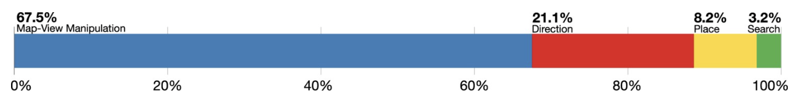
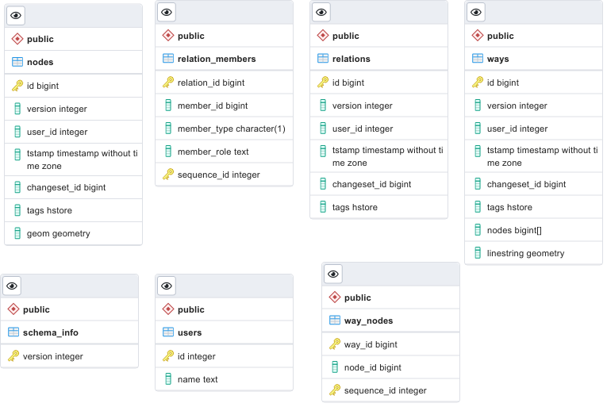

## 1. Тема и целевая аудитория

В работе рассматривается *картографический сервис*. Пример так таких сервисов и размер их аудитории:

| Сервис      | MAU             |
| ----------- | --------------- |
| Google Maps | ~1.5 млрд. [^1] |
| Apple Maps  | 590 млн.[^1]    |
| Maps Me     | 60 млн.[^2]     |
| Waze        | 140 млн.[^3]    |
| MapQuest    | 40 млн.[^4]     |

### MAU

Исходя из представленных данных, потенциальная максимальная месячная аудитория сервиса может составлять **150-200 млн.** пользователей (Google Maps и Apple Maps вероятнее всего достигли выдающих размеров аудитории в том числе за счет переустановки приложений в Android и IOS[^1]).

### DAU

Известна статистика об использовании картографических приложений: 11.3% пользователей используют приложения каждый день, 39% множество раз в неделю (допустим 5 раз в неделю), 27% несколько раз в неделю (допустим 3 раза в неделю), 19.5% используют несколько раз в месяц (допустим 3 раза в месяц) [^5]. Исходя их этого, можно рассчитать что DAU составляет `11.3 + 39 * 5/7+27 * 3/7 + 19.5 * 3/30 = 52.7%` от MAU. Таким образом, для проектируемого сервиса, число ежедневных пользователей - **80-105 млн.**

### Расположение аудитории

Сервисы-аналоги обслуживают аудиторию со всего мира. Исходя из данных по распределению пользователей Интернета по частям света[^6] , можно рассчитывать на следующие размеры аудитории (тут и далее положим MAU и DAU сервиса **175 млн.** и **93 млн.** соответственно):

| Регион              | MAU, млн | DAU, млн |
| ------------------- | -------- | -------- |
| Северная Америка    | 11.8     | 6.2      |
| Южная Америка       | 16.8     | 8.9      |
| Европа              | 31.9     | 16.9     |
| Азия                | 93.5     | 49.7     |
| Африка              | 20.1     | 10.7     |
| Австралия и Океания | 1.05     | 0.6      |

### MVP

Ключевой функционал сервиса:

1. Просмотр тайловой карты
2. Геокодинг (поиск координат по адресу)
3. Построение маршрутов

## 2. Расчет нагрузки
### Действия пользователя

Согласно исследованию поведения пользователей в картографических приложениях, среднее время пользовательской сессии составляет 65 секунд[^5], пользователь использует приложение несколько раз в день (1-3 раза). Из этого же исследования известно распределение времени сессии на взаимодействие с функционалом сервиса:

* Map-View Manipulations занимают 67.5% времени сессии. В это взаимодействие входит просмотр, зум и скролинг карты.
  Т.о. манипуляции с просмотром карты занимают в среднем 44 секунды. Предположим что пользователь за это время может обновить экран c карт 6-8 раз (с учетом смены зума). 

  При смене положения карты/уровня зума, происходит запрос тайлов карты. Размер тайлов, обычно 256х256 пикселей и для покрытия экрана 1920х1080 пикселей требуется 40 тайлов. Таким образом за время сессии будет запрашиваться примерно **280 тайлов**. 

* Direction (построение маршрутов) занимают 21.1% времени сессии, т.е. 14 секунд, предположим что за это время пользователь делает **1-2 запроса** на построение маршрута. 

* Place и Search запросы (геокодинг) занимаю 11.4% времени или 8 секунд. За это время пользователь может успеть сделать **3-4 запроса**.

### RPS

Рассчитаем нагрузку на сервис с учетом, что пользователи используют сервис 2 раза в день, а запросы запросы распределены равномерно в течении 24 часов, т.к. аудитория расположена во всех часовых поясах. :

1. Просмотр тайловой карты: `93000000 * 280 * 2  / (24 * 60 * 60) = 602777 RPS`
2. Геокодинг: `93000000 * 4 * 2  / (24 * 60 * 60) = 8611 RPS`
3. Построение маршрутов: `93000000 * 2 * 2  / (24 * 60 * 60) = 4305 RPS`

Сводная таблица по запросам:

| Тип запроса             | RPS     |
| ----------------------- | ------- |
| Просмотр тайловой карты | 602'777 |
| Геокодинг               | 8'611   |
| Построение маршрутов    | 4'305   |
| **Итого**               | 615'693 |

### Трафик

Рассмотрим нагрузку сетевого трафика. В расчетах будем полагаться, что:

* Тайлы представлены в векторном формате[^7] и занимают в серднем **30 КБ**.
* Построенные маршруты представляют собой набор точек на тайлах и занимают **5КБ**.
* Ответы на гекодинг запросы представляют собой точу на тайле/адрес и занимают **1КБ**

Пиковое потребление предполагает увеличение нагрузки в 2 раза.

#### Трафик входящий

1. Загрузка тайла: 

   * Пиковое потребление: `1 КБ * 2 * 602777 RPS = 1205554 КБ/c = 9.6 ГБит/с`

   * Суточное потребление: `1 КБ * 93000000 * 280 * 2 = 52 ТБ `

2. Геокодинг:

   * Пиковое потребление: `1 КБ * 2 * 8611 RPS = 17222 КБ/c = 0.14 ГБит/с`

   * Суточное потребление: `1 КБ * 93000000 * 4 * 2 = 0.74 ТБ `

3. Построение маршрутов: 

   * Пиковое потребление: `1 КБ * 2 * 4305 RPS = 8610 КБ/c = 0.07 ГБит/с`

   * Суточное потребление: `1 КБ * 93000000 * 2 * 2 = 0.37 ТБ `

| Запрос               | Объем 1 запроса | Пиковое потребление (ГБит/с) | Суточное потребление (ТБ/Сутки) |
| -------------------- | --------------- | ---------------------------- | ------------------------------- |
| Загрузка тайла       | 1 КБ            | 9.6                          | 52                              |
| Гекодинг             | 1 КБ            | 0.14                         | 0.74                            |
| Построение маршрутов | 1 КБ            | 0.07                         | 0.37                            |

#### Трафик исходящий

1. Загрузка тайла: 

   * Пиковое потребление: `30 КБ * 2 * 602777 RPS = 36166620 КБ/c = 289 ГБит/с`

   * Суточное потребление: `30 КБ * 93000000 * 280 * 2 = 1000 ТБ `

2. Геокодинг:

   * Пиковое потребление: `1 КБ * 2 * 8611 RPS = 17222 КБ/c = 0.14 ГБит/с`

   * Суточное потребление: `1 КБ * 93000000 * 4 * 2 = 0.74 ТБ `

3. Построение маршрутов: 

   * Пиковое потребление: `5 КБ * 2 * 4305 RPS = 43050 КБ/c = 0.34 ГБит/с`

   * Суточное потребление: `5 КБ * 93000000 * 2 * 2 = 1.86 ТБ `

| Запрос               | Объем 1 ответа | Пиковое потребление (ГБит/с) | Суточное потребление (ТБ/Сутки) |
| -------------------- | -------------- | ---------------------------- | ------------------------------- |
| Загрузка тайла       | 30 КБ          | 289                          | 1000                            |
| Гекодинг             | 1 КБ           | 0.14                         | 0.74                            |
| Построение маршрутов | 5 КБ           | 1.86                         | 1.86                            |

## 3. Логическая схема

База данных имеет постоянный размер. Для базы данных, вмещающей всю Земную поверхность, с указанной схемой (схема пригодна для OSM PBF форматом геоданных) потребуется **300 ГБ** дискового пространства[^8].

Для хранения графа путей потребуется пространства меньше чем для исходной базы данных, т.к. узлы графа не хранят информацию о геометрии и вспомогательную информацию. С запасом, стоит выделить **150 ГБ**.

Хранение информации об адресах и их  координатах требует постоянный объем БД в **450 ГБ**[^10].

Для хранения всех тайлов с 0 по 19 zoom level потребуется **1500 ГБ**. Размер хранилища тайлов также постоянный[^9].

## 4. Физическая схема
Для хранения основного набора данных OSM используется PostgreSQL с расширение PostGIS. Для оптимальной обработки запросов и удобного обновления датасета используем реплецирование. В master базе данных будет происходить обновление геоданных, к slave базам будет обращаться backend отвечающий за рендеринг тайлов.

Для решения задачи построения маршрутов будет использоваться графовая neo4j база данных. neo4j база данных также реплицируется.

Для хранения информации об адресах и координатах будет использоваться специальная база для геокодинга pelias. Согласно рекомендации от разработчиков базу данных вмещающую данных по всей Земле требуется разделить минимум на 12 шардов.

**todo**

## 5. Технологии

## 6. Схема проекта

## 7. Список серверов

## 8. Список источников

[^1]: How many pepople use google maps compared to apple maps - [www.justinobeirne.com](https://www.justinobeirne.com/how-many-people-use-google-maps-compared-to-apple-maps)

[^2]: Mapsme - [ru.maps.me](https://ru.maps.me/app/)

[^3]: Waze statistic and facts - [expandedramblings.com](https://expandedramblings.com/index.php/waze-statistics-facts/)

[^4]: Your Waze map will now show you restaurants that are selling discounted leftover food - [www.fastcompany.com](https://www.fastcompany.com/90666431/your-waze-map-will-now-show-you-restaurants-that-are-selling-discounted-leftover-food)

[^5]: Gian-Luca Savino. MapRecorder: analysing real-world usage of mobile map applications - [www.tandfonline.com](https://www.tandfonline.com/doi/epub/10.1080/0144929X.2020.1714733?needAccess=true)

[^6]: Internet Usage Statistic - [www.internetworldstats.com](https://www.internetworldstats.com/stats.htm)
[^7]: Как мы делаем карту для тех, кто делает карту - [habr.com](https://habr.com/ru/company/2gis/blog/341508/)
[^8]: Serving tiles - [switch2osm.org/](https://switch2osm.org/serving-tiles/)
[^9]: Tile disk usage - [wiki.openstreetmap.org](https://wiki.openstreetmap.org/wiki/Tile_disk_usage)
[^10]: Considerations for full-planet builds - [github.com/pelias](https://github.com/pelias/documentation/blob/master/full_planet_considerations.md)
